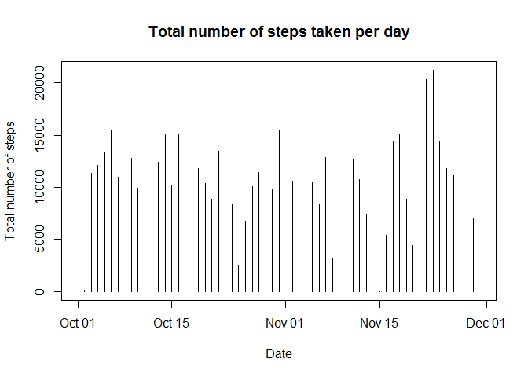
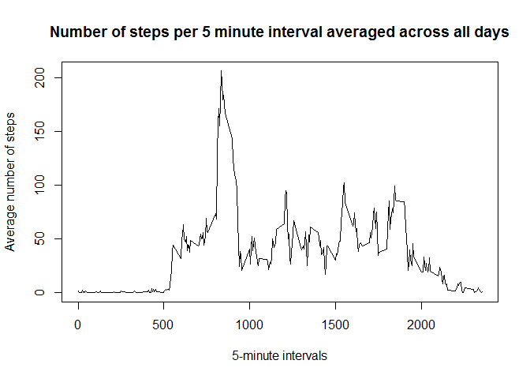
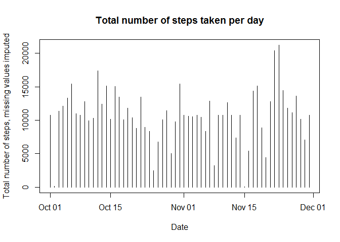
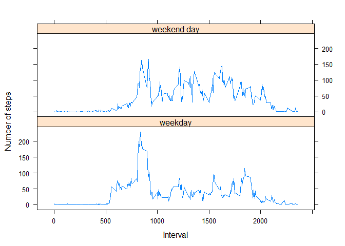

# Reproducible Research: Peer Assessment 1


## Loading and preprocessing the data

1) Load the data

Read activity.csv from activity.zip. The activity.zip archive is located in the local directory. 


```r
data <- read.csv(unz("activity.zip","activity.csv"), stringsAsFactors = FALSE)
```

2) Process the data

Convert the data column from activity.csv to type "date".


```r
data$date <- as.Date(data$date,format = "%Y-%m-%d")
```

## What is mean total number of steps taken per day?

1) Plot a histogram of the total number of steps taken per day.

The total number of steps taken per day is calculated by grouping the count data by date and calculating the sum per date. 


```r
library(dplyr)
```

```
## 
## Attaching package: 'dplyr'
## 
## The following object is masked from 'package:stats':
## 
##     filter
## 
## The following objects are masked from 'package:base':
## 
##     intersect, setdiff, setequal, union
```

```r
data2 <- tbl_df(data)
data_steps_per_day <- group_by(data2, date) %>%
summarize(sum(steps)) 

plot(x = data_steps_per_day$date, y = data_steps_per_day$sum, type = "h", xlab="Date", ylab ="Total number of steps", main= "Total number of steps taken per day")
```

 

```r
# Calculating mean and median. Note that dates where sum is NA are ignored.
mean_steps_per_day <- mean(data_steps_per_day$sum, na.rm = TRUE)
median_steps_per_day <- median(data_steps_per_day$sum, na.rm = TRUE)
```

2) Calculate the median and mean of the number of steps per day

The mean number of steps per day is 1.0766189\times 10^{4}
The median number of steps per day is 10765

Note: Dates without any step counts are ignored for calculating the mean and median. 

## What is the average daily activity pattern?

1) Make a time series plot of the 5-minute interval (x-axis) and the average number of steps taken, averaged across all days (y-axis)


```r
data_mean_steps_per_interval <- group_by(data2, interval) %>%
summarize(mean(steps, na.rm = TRUE)) 

plot(x = data_mean_steps_per_interval$interval, y = data_mean_steps_per_interval$mean, type = "l", xlab="5-minute intervals", ylab ="Average number of steps", main = "Number of steps per 5 minute interval averaged across all days")
```

 

```r
#calculate interval with highest number of steps
max_interval_index <- which.max(data_mean_steps_per_interval$mean)
max_interval_number <- data_mean_steps_per_interval$interval[max_interval_index]
```

2) Calculate the 5-minute interval with highest average number of steps.

The 5-minute interval with highest number of steps is: 835

## Imputing missing values


1) Calculate and report the total number of missing values in the dataset (i.e. the total number of rows with NAs)


```r
number_of_missing_values <- sum(is.na(data$steps))
```

The number of missing values: 2304

2) Create a new dataset that is equal to the original dataset but missing data is filled in using the mean for the 5-minute interval across all days.


```r
# merge average steps per 5-minute interval
data_imputed <- merge(data2, data_mean_steps_per_interval, by = "interval")

# replace missing values with average values
data_imputed$steps[is.na(data_imputed$steps)] <- data_imputed$mean[is.na(data_imputed$steps)]
```


3) Make a histogram of the total number of steps taken each day. Calculate and report the mean and median total number of steps taken per day. 


```r
data_imputed_steps_per_day <- group_by(data_imputed, date) %>%
summarize(sum(steps)) 

plot(x = data_imputed_steps_per_day$date, y = data_imputed_steps_per_day$sum, type = "h", xlab="Date", ylab ="Total number of steps, missing values imputed", main= "Total number of steps taken per day")
```

 

```r
# Calculating mean and median of imputed data.
mean_imputed_steps_per_day <- mean(data_imputed_steps_per_day$sum, na.rm = TRUE)
median_imputed_steps_per_day <- median(data_imputed_steps_per_day$sum, na.rm = TRUE)
```

The imputed mean is 1.0766189\times 10^{4} and imputed median is 1.0766189\times 10^{4}

The original mean is 1.0766189\times 10^{4} and original median is 10765

Imputing caused no impact on the mean steps per day. However, imputing very slightly impacted the median as it is now equal to the mean.

## Are there differences in activity patterns between weekdays and weekends?

1.Create a new factor variable in the dataset with two levels - "weekday" and "weekend" indicating whether a given date is a weekday or weekend day.


```r
#add weekdays column to imputed data
data_imputed <- mutate(data_imputed, day_type = weekdays(data_imputed$date))

#replace weekday name with either "weekend day" or "weekday"
data_imputed$day_type[data_imputed$day_type == "Saturday" | 
                        data_imputed$day_type == "Sunday"] <- "weekend day"
data_imputed$day_type[data_imputed$day_type != "weekend day"] <- "weekday"

#convert column to a type "factor"
data_imputed$day_type <- as.factor(data_imputed$day_type)
```
2.Make a panel plot containing a time series plot (i.e. type = "l") of the 5-minute interval (x-axis) and the average number of steps taken, averaged across all weekday days or weekend days (y-axis).


```r
#calculate mean number of steps per interval grouped by day_type
data_imputed_mean_steps_per_interval <- group_by(data_imputed, interval, day_type) %>%
summarize(mean(steps, na.rm = TRUE)) 

#renaming mean column "mean(steps, na.rm = TRUE)" to "mean" to work with xyplot
names(data_imputed_mean_steps_per_interval)[3] <- "mean"

# create a panel plot  
# Note: the sample plot in git appears to calculate a log.  However, I choose not to use the log function, as I think the data is more intutively accessible without a log function, and using a log function was not explicitly called out in the instructions.

library(lattice) 
xyplot(mean ~ interval | day_type, data = data_imputed_mean_steps_per_interval, layout = c(1,2), type="l", ylab = "Number of steps", xlab = "Interval")
```

 
